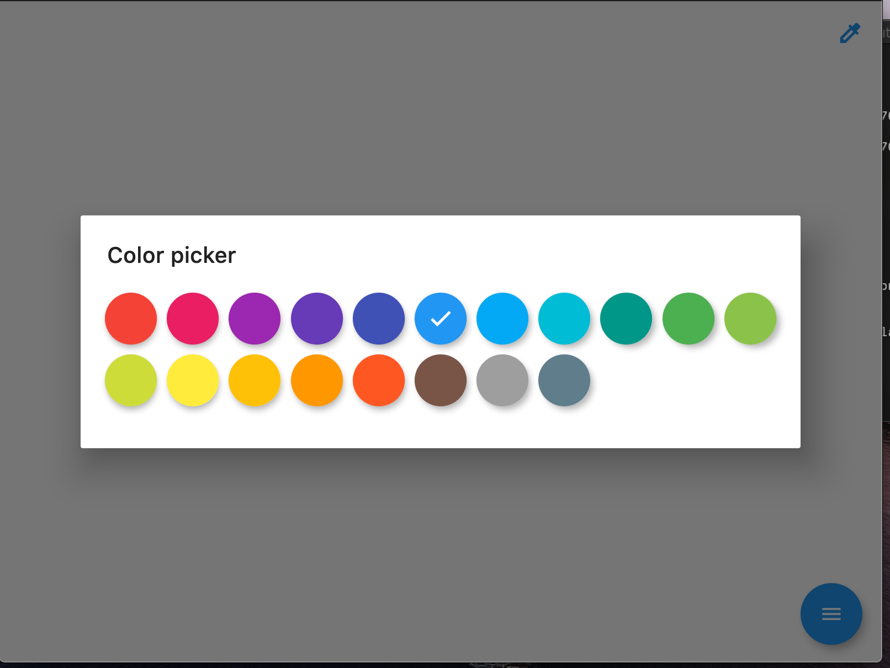

# Ayaan's Whiteboard
> Realtime whiteboard, connect and interactivelly share your drawings.


     

     
 

One to two paragraph statement about your product and what it does.




## Installation

Web:

```sh
docker build -t . <image-name>
docker run -p 8080:8080 <image-name>
```

## Usage example

A few motivating and useful examples of how your product can be used. Spice this up with code blocks and potentially more screenshots.

_For more examples and usage, please refer to the [Wiki][wiki]._


## Meta

Faizal Patel – [@fpatelm](https://twitter.com/fpatelm)

Distributed under the MIT license. See ``LICENSE`` for more information.

[https://github.com/fpatelm/whiteboard-frontend/](https://github.com/fpatelm/whiteboard-frontend/)


<!-- Markdown link & img dfn's -->
[npm-image]: https://img.shields.io/npm/v/datadog-metrics.svg?style=flat-square
[npm-url]: https://npmjs.org/package/datadog-metrics
[npm-downloads]: https://img.shields.io/npm/dm/datadog-metrics.svg?style=flat-square
[travis-image]: https://img.shields.io/travis/dbader/node-datadog-metrics/master.svg?style=flat-square
[travis-url]: https://travis-ci.org/dbader/node-datadog-metrics
